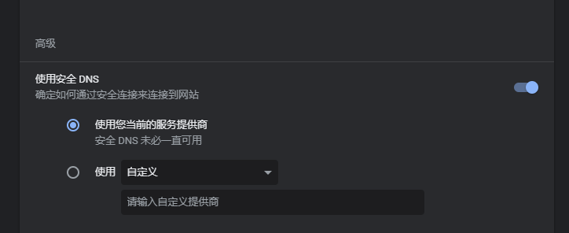
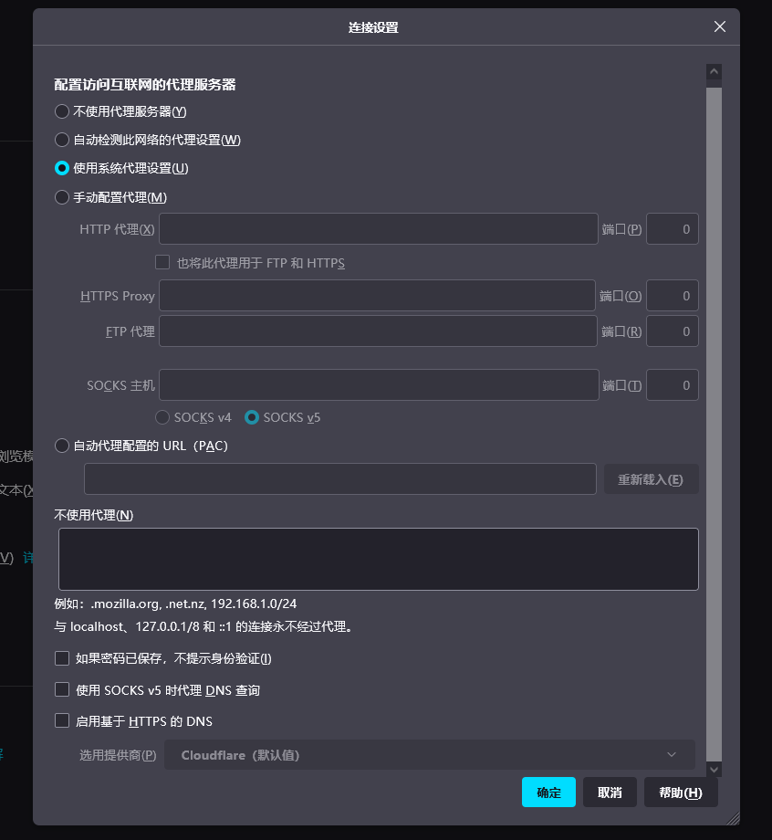

# DNS-over-HTTPS 设置

## Chrome

[Chrome内点击该URL](chrome://settings/security)，在 “安全DNS” 下面设置，可以直接填入 “ https:// ” 开头的链接

## FireFox 

[FF内点击该URL](about:preferences#general)，拖动到最下方，找到 “网络设置”，在最下方勾选 “启用基于HTTPS的DNS”

